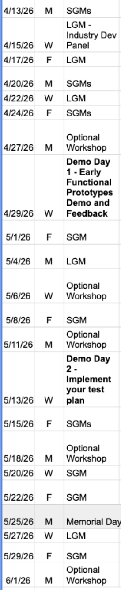

_This README is a static copy of our [Wiki home page](https://github.com/StanfordCS194/spr26-Team-14/wiki). It may be out of sync. :)_

***

🎵 **Theme Music:** [Inception Soundtrack — Hans Zimmer, "Time"](https://www.youtube.com/watch?v=RxabLA7UQ9k)

## First time?
We're so excited to have you check out our repo! Check out [Developer Environment Setup](https://github.com/StanfordCS194/spr26-Team-14/wiki/Developer-Environment-Setup) for first steps.

## Project Synopsis
As people increasingly move to AI chatbots, companies need ways to track and improve how their products and services are mentioned and discussed by these tools. We're building **Perception**, a platform that gives companies visibility into AI-generated brand mentions and actionable insights to improve how they appear in AI responses.

## Our Team
|  |  |  |  |  |
|:--:|:--:|:--:|:--:|:--:|
| Arun Moorthy | Welton Wang | Charlotte Yan | Krish Maniar | Connor Fogarty |
| amoorth2@stanford.edu | welton@stanford.edu | ckyy@stanford.edu | kmaniar@stanford.edu | cfogarty@stanford.edu |

## Team Member Matrix
Member | Areas of Expertise | Personal Traits | Gaps/Weaknesses
--- | --- | --- | --- 
Arun Moorthy | Software development, customer feedback, scaling applications | Nice, kind, confident | Sometimes can be too agreeable 
Welton Wang | Python, design, infrastructure, products | Problem solver | Math, writing 
Charlotte Yan | Designing benchmarks, computer use agents, ethics | Detail oriented | Physics
Krish Maniar | Backend, databases | Nice, chill | Too much of a perfectionist
Connor Fogarty | Database design, production code | Easygoing | Sometimes can be too easygoing

## Product Requirements Document (PRD)
https://docs.google.com/document/d/1_7ihu_LTOc90rLPz_Z4Qi2hujh1mniR2B4RlztDDm_A/edit?tab=t.0#heading=h.mzf2knh2cjc1

## Weekly Schedule

## Source control with git (write name here)
Charlotte
